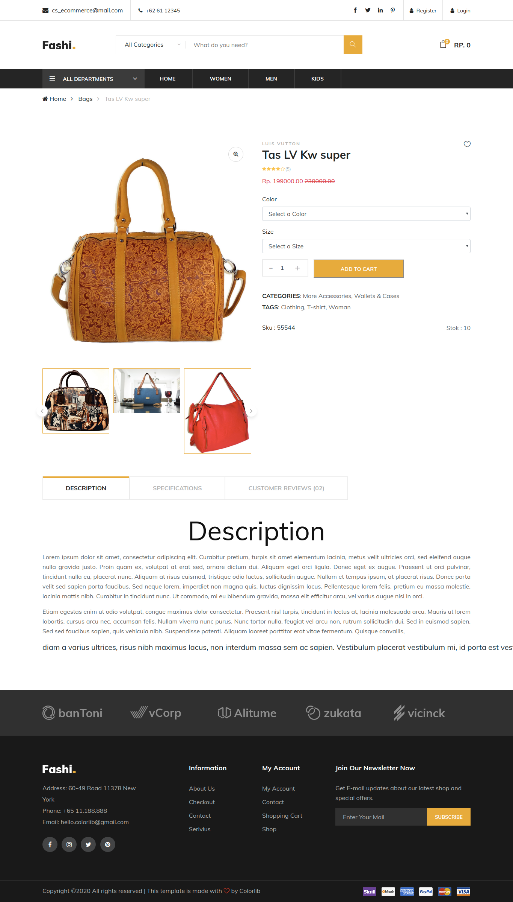
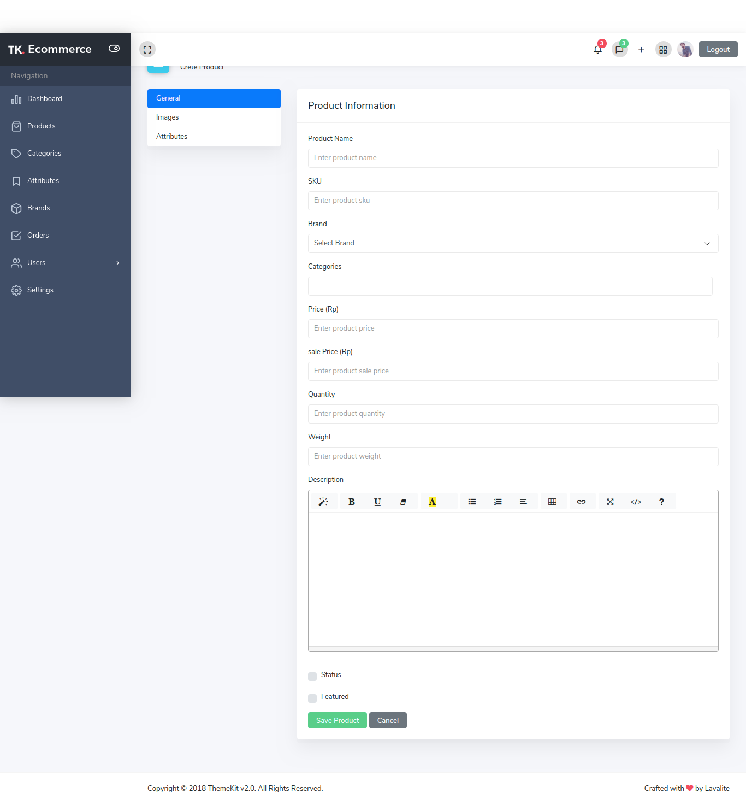

## About Laravel Ecommerce v-1

this a laravel ecommerce. most simple using pattern repository for laravel and implementation paypal payment. the feature are:

-catalog page where all products will be displayed to buyers.
-A product details page where buyers can find more information about the product.
-A checkout system, where buyers can enter the shipping address and pay.
-Login and registration pages so buyers can register or login to their account.
-Account dashboard for customers where they can see recent orders placed, or can change their account details.
-An admin area where shop owner can log in and manage followings:
--Manage store settings.
--Manage products, categories, brands, product attributes.
--Manage sales orders and can generate reports.
--Manage payment methods available to customers.
--Manage Shipping methods available to customers.
--Manage admin users so other staff members use the admin area.

thank for <a href="https://colorlib.com/wp/template/fashi/">Fashi the ecommerce template</a>
thanks for <a href="http://themekit.lavalite.org/">Themekit for backend template</a>
